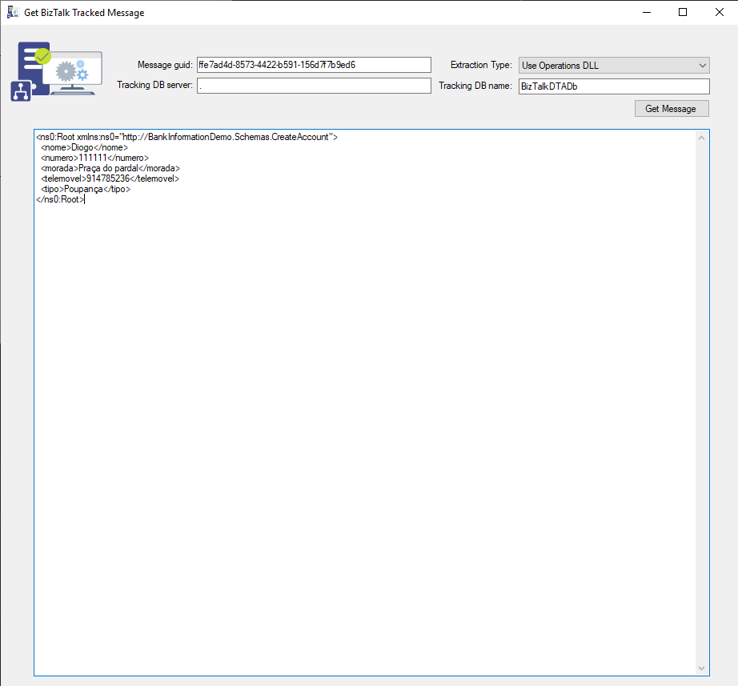

# BIzTalk GetTrackedMessage Tool
This tool allows you to extract a message body from the BizTalk tracking database using 3 possible ways: 
* Operations DLL
* SQL, 
* and WMI

The application has only one form (print-screen below), and expects the following parameters:
* The message guid of the message you want to extract.
* The extraction type (Use Operations DLL, Use SQL, Use WMI)
* Tracking DB server (the BizTalk server name)
* Tracking DB name (the BizTalk Tracking database name)

More details here: [3 ways of programmatically extracting a message body from the BizTalk tracking database](https://www.connected-thoughts.com/2008/04/02/3-ways-of-programatically-extracting-a-message-body-from-the-biztalk-tracking-database/)

THIS TOOL IS PROVIDED "AS IS", WITHOUT WARRANTY OF ANY KIND.

# Credits
**Thiago Almeida** | [Linkedin](https://www.linkedin.com/in/thiagoalmeidaprofile/)

# About Us
**Sandro Pereira** | [DevScope](http://www.devscope.net/) | MVP & MCTS BizTalk Server 2010 | [https://blog.sandro-pereira.com/](https://blog.sandro-pereira.com/) | [@sandro_asp](https://twitter.com/sandro_asp)

**Diogo Formosinho** | [DevScope](http://www.devscope.net/) | BizTalk Server Developer | [https://www.linkedin.com/in/diogo-formosinho-242b221a2/](https://www.linkedin.com/in/diogo-formosinho-242b221a2/)